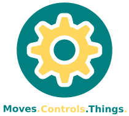
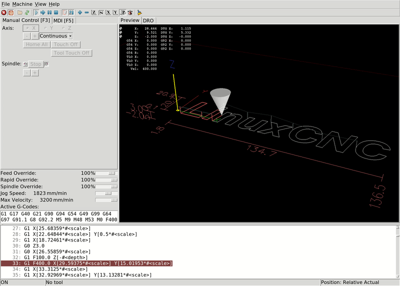

<h1 align="center">EMCApplication</h1>

<div align="center"></div>

<h4 align="center">Machinekit <i>Featured Application</i> for <b>E</b>nhanced <b>M</b>otion <b>C</b>ontroller from LinuxCNC.</h4>

<p align="center">


<a href="https://matrix.to/#/#machinekit:matrix.org" target="_blank">

</a>

<a href="https://groups.google.com/forum/#!forum/machinekit" target="_blank">

</a>

<a href="http://www.machinekit.io/community/c4/" target="_blank">

</a>

</br>

<a href="https://cloudsmith.io/~machinekit/repos/emcapplication/packages/" target="_blank">

</a>

<a href="https://cloudsmith.io/~machinekit/repos/machinekit-hal/packages/" target="_blank">

</a>

<a href="https://cloudsmith.io/~machinekit/repos/machinekit/packages/" target="_blank">

</a>
</p>

<p align="center">
<a href="https://machinekit.io/">Website</a>
|
<a href="https://machinekit.io/docs">Docs</a>
|
<a href="http://www.machinekit.io/about">About</a>
</p>

**EMCApplication** is the _**E**nhanced **M**otion **C**ontroller_ developed as part of [LinuxCNC](https://github.com/linuxcnc/linuxcnc) ported to use the powerfull [Machinekit-HAL](https://github.com/machinekit/machinekit-hal) backend. With this package integrators can quickly create **CNC** solution to controll a **mill** or a **lathe** or **any other** application which would benefit from **G-Code** based motion controller.

<div align="center"></div>

## Getting started

The recommended way how to get running quickly is to install Debian package. As the **EMCApplication** contains only the CNC portion, the **Machinekit-HAL** is required dependency and can also be installed as a Debian package.

While _**R**un-**I**n-**P**lace_ is theoretically possible, the **Machinekit-HAL** stil has to be installed (respective libraries needs to be exported with _pkg-config_) and _real-time_ components of EMCApplication has to be installed into Machhinekit-HAL specified directory.

**Machinekit organization** keeps current Debian packages in specific repositories: The EMCApplication can downloaded from official [Machinekit/EMCApplication repository](https://cloudsmith.io/~machinekit/repos/emcapplication/packages/), Machinekit-HAL from [Machinekit/Machinekit-HAL repository](https://cloudsmith.io/~machinekit/repos/machinekit-hal/packages/), other dependencies then from [Machinekit/Machinekit repository](https://cloudsmith.io/~machinekit/repos/machinekit/packages/). Allpackages repositories are kindly hosted by [Cloudsmith](https://cloudsmith.io).

Presuming newly installed Debian Buster system (for example Docker container), the following sequence of commands would be needed to install **EMCApplication** as a _non-root_ user with _sudo_ rights:

```sh
curl -1sLf \
  'https://dl.cloudsmith.io/public/machinekit/machinekit/cfg/setup/bash.deb.sh' \
  | sudo -E bash
curl -1sLf \
  'https://dl.cloudsmith.io/public/machinekit/machinekit-hal/cfg/setup/bash.deb.sh' \
  | sudo -E bash
curl -1sLf \
  'https://dl.cloudsmith.io/public/machinekit/emcapplication/cfg/setup/bash.deb.sh' \
  | sudo -E bash
sudo apt install emcapplication
```

If you want to compile the _**R**un-**I**n-**P**lace_ version onto Debian Buster, the following sequence of commands would be needed (again as a _non-root_ user with _sudo_ rights):

```sh
curl -1sLf \
  'https://dl.cloudsmith.io/public/machinekit/machinekit/cfg/setup/bash.deb.sh' \
  | sudo -E bash
curl -1sLf \
  'https://dl.cloudsmith.io/public/machinekit/machinekit-hal/cfg/setup/bash.deb.sh' \
  | sudo -E bash
git clone https://github.com/machinekit/emcapplication.git
cd emcapplication
sudo apt install build-essential fakeroot devscripts python
debian/configure machinekit-hal no-docs
mk-build-deps -irs sudo
cd src
./autogen.sh
./configure --with-hal=machinekit-hal
make
sudo make install
cd ..
source ./scripts/rip-environment
```

|| Be advised that currently there is no support for Linux distributions other than Debian. |
|:---:|---|


## Frequently asked questions

|| What is the difference between **EMCApplication** and **Machinekit-CNC**? |
|:---:|---|
|| **Machinekit-CNC** is the **Machinekit organization** project for CNC application based on **Machinekit-HAL** backend.**EMCApplication** on other hand is ported **Enhanced Motion Controller** from LinuxCNC to use the **Machinekit-HAL**. All development of new functionality happens in **LinuxCNC** under supervision of **LinuxCNC community**. Development on **Machinekit** side is strictly limited to creating the compatibility layer to support the different **Machinekit projects**, mainly [**Machinekit-HAL**](https://github.com/machinekit/machinekit-hal). |

|| Is the **LinuxCNC** documentation valid for **EMCApplication**? |
|:---:|---|
|| **No.** **Well, it depends.** Documentation pertaining the **Enhanced Motion Controller** will be mostly valid. (G-Code documentation, motion planner manual, GUI tutorials.) However, anything specific to HAL layer (including simple tools like _PNCconf_ or _Stepconf_) will be inherently wrong and should not be used. |

|| What's does the term _Featured Application_ mean? |
|:---:|---|
|| **Featured Application** is _terminus technicus_ coined by **Machinekit organization** to give universal title to all projects using **Machinekit-HAL** backend and building new applications on top of it. |

|| How can I determine if **.deb** package is from official distribution? |
|:---:|---|
|| Every package should be signed by [**dpkg-sig**](https://manpages.debian.org/buster/dpkg-sig/dpkg-sig.1.en.html) tool. Packages built by [Machinekit](https://machinekit.io) from official repository [_Machinekit/EMCApplication_](https://github.com/machinekit/emcapplication) are signed by the [4A374E9D7CA79FA717293B98D2EFAE426CDDB0FE](https://keyserver.ubuntu.com/pks/lookup?search=0x4A374E9D7CA79FA717293B98D2EFAE426CDDB0FE&fingerprint=on&op=index) sub-key. Forks will use different key or will not sign the packages. |

## Getting involved

**Machinekit-HAL** like all projects in the **Machinekit** organization is volunteer based governed by the [**C**ollective **C**ode **C**onstruction **C**ontract ](http://www.machinekit.io/community/c4), generally known as a C4 originally from the [ZeroMQ](https://rfc.zeromq.org/spec/22) project.

The source code is hosted publicly on [GitHUB](https://github.com/machinekit/emcapplication), where majority of discussion happens. In lower measures, EMCApplication is also discussed on [_Machinekit forum_](https://groups.google.com/forum/#!forum/machinekit) and in [_Machinekit Matrix Room_](https://matrix.to/#/#machinekit:matrix.org), which are used more to the point of support platforms and for general chat.

Synchronization of **EMCApplication** and **LinuxCNC** is done by _merging-in_ changes from _upstream_ **LinuxCNC** repository into **EMCApplication** _downstream_ repository.

|| Development in [**EMCAplicattion** repository](https://github.com/machinekit/emcapplication) is limited strictly to compatibility layer between **Machinekit** projects and **LinuxCNC**. If you want to develop new functionality or post patch for bug repair, please, head to the [**LinuxCNC** repository](https://github.com/linuxcnc/linuxcnc). If you want to develop CNC application in scope of **Machinekit organization**, please head to [**Machinekit-CNC** repository](https://github.com/machinekit/machinekit-cnc) |
|:---:|---|

## Licence

This software is released under the **GPLv2**, with some parts under the **LGPL**. See the file COPYING or COPYING.more for more details.

|| For more detailed information consult specific files with source code implementing given functionality. There should be explicit licensing. |
|:---:|---|

</br>

Original *LinuxCNC* README.md:

# LinuxCNC

LinuxCNC controls CNC machines. It can drive milling machines, lathes, 3d printers, laser cutters, plasma cutters, robot arms, hexapods, and more. http://linuxcnc.org/

# DISCLAIMER

**THE AUTHORS OF THIS SOFTWARE ACCEPT ABSOLUTELY NO LIABILITY FOR ANY
HARM OR LOSS RESULTING FROM ITS USE.**

**IT IS _EXTREMELY_ UNWISE TO RELY ON SOFTWARE ALONE FOR SAFETY.**

**Any machinery capable of harming persons must have provisions for
completely removing power from all motors, etc, before persons enter
any danger area.**

**All machinery must be designed to comply with local and national
safety codes, and the authors of this software can not, and do not,
take any responsibility for such compliance.**


This software is released under the GPLv2, with some parts under the LGPL.
See the file COPYING for more details.


# The Build Process

Refer to the file 'docs/src/code/building-linuxcnc.txt' for information
about building and running the software, or look here:

http://linuxcnc.org/docs/devel/html/code/building-linuxcnc.html
